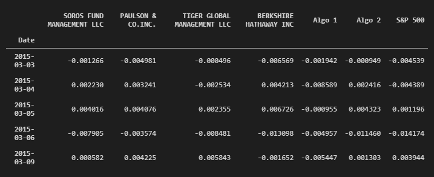
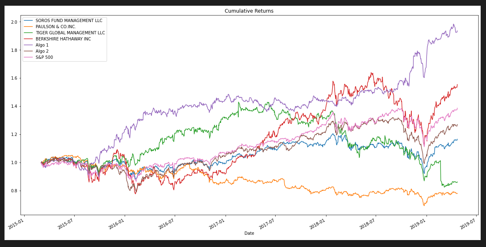
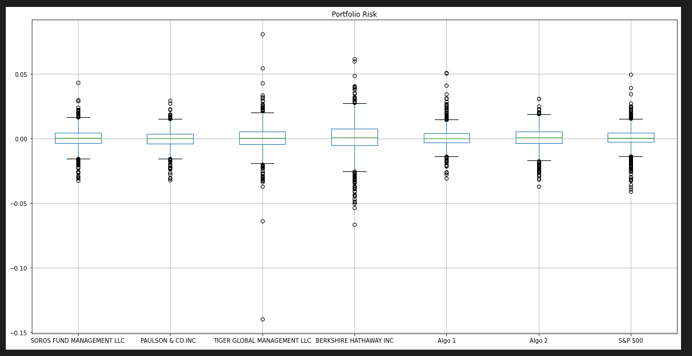
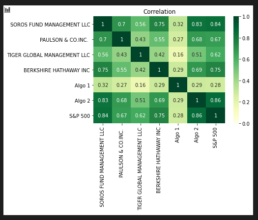

# A Whale Off the Port(folio)
#### Assignment to show learning of pandas, python, and financial topics over the last several weeks in the Rice University FinTech Bootcamp!

---

## Table of contents
* [General info](#general-info)
* [Screenshots](#screenshots)
* [Technologies](#technologies)
* [Installation Guide](#installation-guide)
* [Code Examples](#code-examples)
* [Usage](#usage)
* [Sources](#sources)
* [Status](#status)
* [Contributors](#contributors)

---

## General information
The following repository encompasses skills learned regarding Python, the Pandas library, and quantitative analysis techniques.  The assignment is to create a tool, an analysis notebook, that analyzes and visualizes portfolios across the various metrics to determin which portfolios outperformed the others and the market.

---

## Screenshots
### Various tools and metrics used in the analysis
* Combined Whale, Algorithmic, and S&P 500 Returns

* Performance - Cumulative Returns

* Range of Risk

* Correlation Heatmap

---

## Technologies

---

## Installation Guide

---

## Code Examples

---

## Usage

---

## Sources

---

## Status

Project is: _in progress_

---

## Contributors

* Jonathan Owens
* Jonathan.Owens@gmail.com,
* LinkedIn: www.linkedin.com/in/jonathan-owens-b7951219
