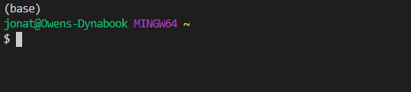
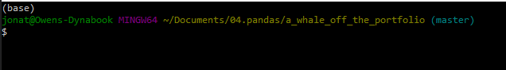
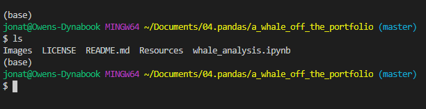
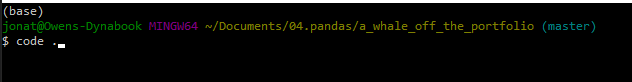
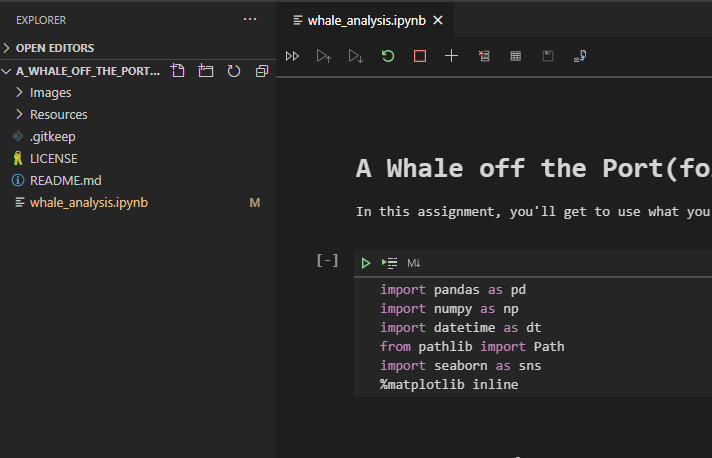
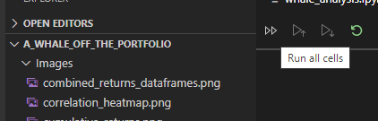

# A Whale Off the Port(folio)
#### Assignment to show learning of pandas, python, and financial topics over the last several weeks in the Rice University FinTech Bootcamp! [1]

---

## Table of contents
* [General info](#general-info)
* [Screenshots](#screenshots)
* [Technologies](#technologies)
* [Installation Guide](#installation-guide)
* [Code Examples](#code-examples)
* [Usage](#usage)
* [Sources](#sources)
* [Status](#status)
* [Contributors](#contributors)

---

## General information
The following repository encompasses skills learned regarding Python, the Pandas library, and quantitative analysis techniques.  The assignment is to create a tool, an analysis notebook, that analyzes and visualizes portfolios across the various metrics to determin which portfolios outperformed the others and the market.[1]

---

## Screenshots
### Various tools and metrics used in the analysis
* Combined Whale, Algorithmic, and S&P 500 Returns


* Performance - Cumulative Returns


* Range of Risk


* Correlation Heatmap


---

## Technologies
    * Python - Version 3.8.5
    * VS Code - Version 1.49.1
    * Jupyter Notebook - Version 6.1.1
    * Windows 10
    * Library - pandas
    * Library - numpy
    * Library - datetime
    * Library - pathlib
    * Library - seaborn
    * Library - matplotlib

---

## Installation Guide
1. Download entire repository titled, a_whale_off_the_portfolio

2. Open Git Terminal
    
    
    
3. Navigate into repository file path where the repository downloaded.

    

4. The files should be visible and ready to run by typing the 'ls' command in the prompt and pressing the Enter key on your keyboard.  You should see the following files and the whale_analysis.ipynb notebook.

    

*See [Usage](#usage) section below for instructions how to run the program.

---

## Code Examples

- Calculating cumulative returns and plotting data

``` python
# Plot cumulative returns
cumulative_returns = (1 + combined_returns).cumprod()
cumulative_returns.plot(title="Cumulative Returns", figsize=(20,10))
```

- To compare which portfolios carry a greater risk than the S&P 500 based on daily standard deviation.

``` python
# Determine which portfolios are riskier than the S&P 500
index_num = 0
for portfolio in combined_daily_std:
    if portfolio > combined_daily_std["S&P 500"]:
        true_false = "True"
        print(f"{combined_daily_std.index[index_num]:<30}{true_false:>6}")
    else:
        true_false = "False"
        print(f"{combined_daily_std.index[index_num]:<30}{true_false:>6}")
    index_num += 1
```

- Calculating Beta for one portfolio compared to the S&P 500 and plotting the information.

``` python
rolling_covariance = combined_returns['BERKSHIRE HATHAWAY INC'].rolling(window=21).cov(combined_returns['S&P 500'])
rolling_variance = combined_returns['S&P 500'].rolling(window=21).var()
rolling_beta = rolling_covariance / rolling_variance
rolling_beta.plot(figsize=(20,10), title="Berkshire Hathaway Inc Beta")
```

---

## Usage

1. To run the analysis process, navigate to the directory where whale_analysis.ipynb is located using Git Terminal within the a_whale_off_the_portfolio directory.

    

2. Execute the command 'code .' in the terminal to open VS Code.

    

3. VS Code opens.  Select the main.ipynb file in the PyBank directory.

    

4. Click the Run All Cells button, double arrows, to run all cells in the Jupyter Notebook file.

    

5. All cells in the notbook run.

---

## Sources

- [1] https://rice.bootcampcontent.com/Rice-Coding-Bootcamp/rice-hou-fin-pt-09-2020-u-c/tree/master/hw/04-Pandas/Instructions

---

## Status

Project is: _in progress_

---

## Contributors

* Jonathan Owens
* Jonathan.Owens@gmail.com,
* LinkedIn: www.linkedin.com/in/jonathan-owens-b7951219
